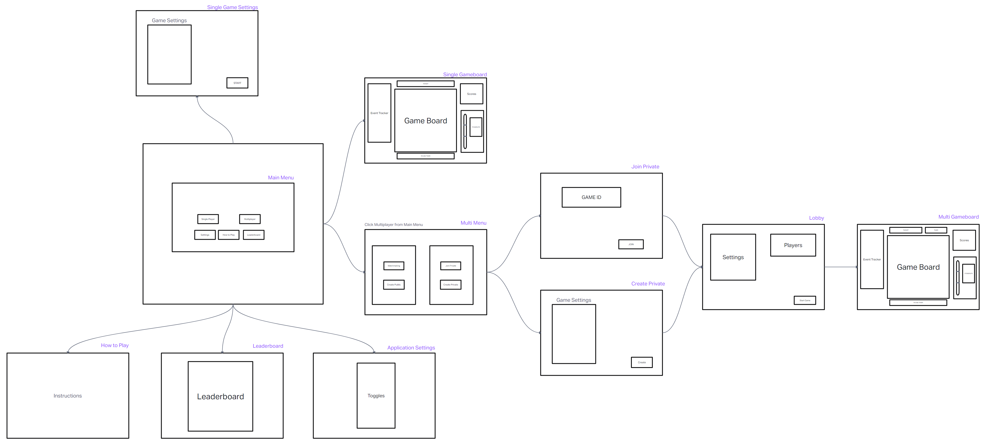

# Word Rummage Refactor

Initial project was built with HTML, JavaScript, and CSS. This refactor is built with React.

**DEPLOYED WITH NETLIFY [HERE](https://wordrummage2.netlify.app/)**

[Word Rummage 1.0](https://github.com/Word-Rummage/Word-Rummage)

[Repo](https://github.com/The-Dangerzone/WordRummage-BE) for the server.

Refactor members: Jordan Covington and Joe Davitt

## Startup

Clone the repo.

Use `npm install` to install the required node_modules.

Use `npm start` to run the application.

## Tools Used
<!-- add links -->
- React
- Axios
- Auth0
- Material UI

## Audio

Music from [ZapSplat](https://www.zapsplat.com)

Sound Effects from [ZapSplat](https://www.zapsplat.com)

## Wireframe

